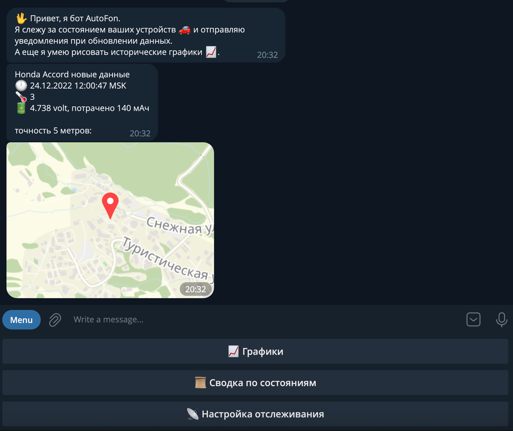
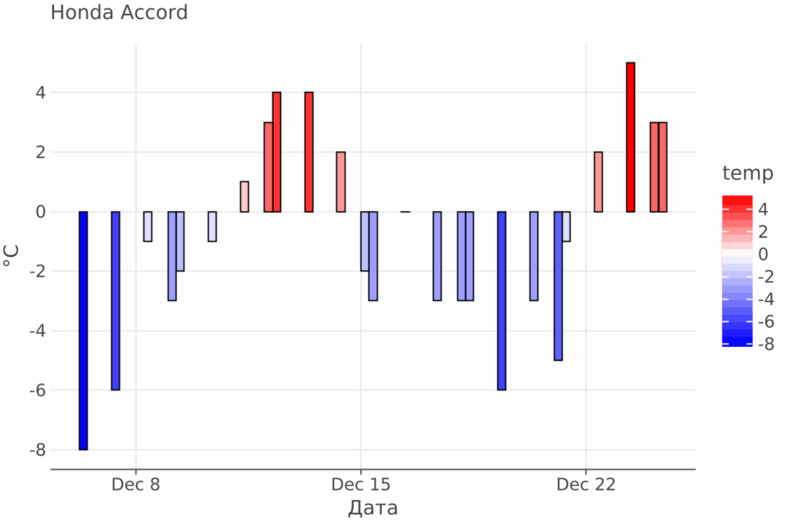
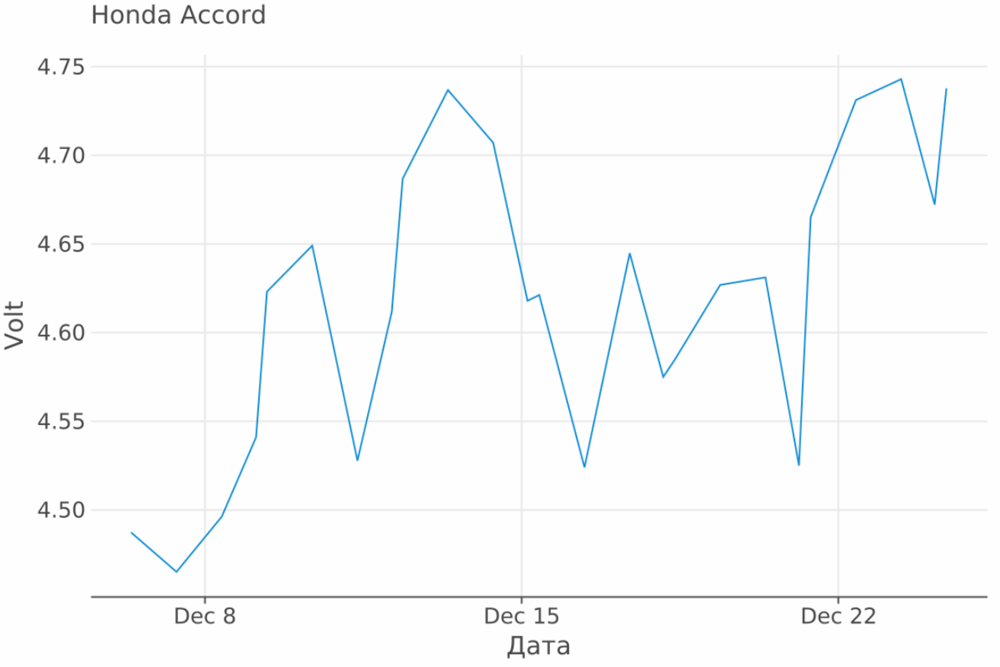
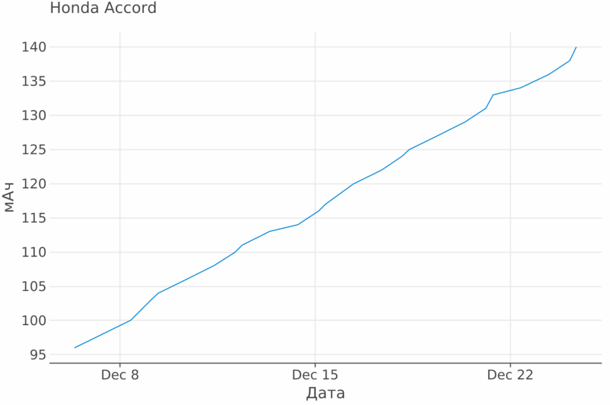

# АвтоФон Telegram Бот

Self-hosted Телеграм бот для отслеживания устройств [АвтоФон](http://www.autofon.ru/).

## Функции бота

* Отслеживание ваших устройств АвтоФон
* Отправка уведомление в Телеграм с информацией о новом состоянии, включая:
    * Наименование устройства (настраивается в [личном кабинете АвтоФон](https://control.autofon.ru/devices/))
    * Время обновления состояния
    * Текущую температуру
    * Напряжение батареи и количество затраченных мАч
    * Текущее местоположение устройства и точность определения
* Предупреждение о низком балансе на сим-картах
* Настраиваемый список устройств для отслеживания
* Формирование графиков на основе истории состояний устройств
* Получение сводной информации о сохраненных состояниях устройств

## Графики

Температура с датчика устройства

Напряжение батареи

Затраченное мАч батареи

## Запуск

Для запуска бота через docker compose необходимо:

1. Установить [Docker](https://docs.docker.com/get-docker/)
   и [Docker Compose](https://docs.docker.com/compose/install/).
2. Создать вашего бота и получить токен у [@BotFather](https://t.me/BotFather).
3. Узнать свой `chat_id` у [@userinfobot](https://t.me/userinfobot).
4. Заполнить [docker-compose.yml](/src/main/docker/docker-compose.yml) файл обязательными
   переменными ``AUTOFON_TELEGRAM_TOKEN``, ``AUTOFON_TELEGRAM_CHAT_ID``, ``AUTOFON_API_KEY``, ``AUTOFON_API_PASSWORD``.
   https://github.com/Romancha/autofon-telegram-bot/blob/7d83bf06cbb0f98672e324e1af602015dbd29768/src/main/docker/docker-compose.yml#L1-L12
5. В ``volumes`` первый путь должен быть указан к папке на вашем устройстве, куда будет сохраняться файл с базой данных
   бота.
6. Выполнить команду для запуска ``docker-compose up -d``.

После запуска бота бот отправит приветственное сообщение в указанный чат. Если бот не отправил сообщение, проверьте
правильность заполнения переменных и проверьте логи бота ``docker-compose logs -f``.

Для добавления устройства в список отслеживаемых, нажмите на кнопку "Настройка отслеживания" в боте.

## Доступные параметры

| Параметр                                   | Описание                                                                                                                                                          |
|--------------------------------------------|-------------------------------------------------------------------------------------------------------------------------------------------------------------------|
| AUTOFON_TELEGRAM_TOKEN                     | Токен телеграм бота, полученный у [@BotFather](https://t.me/BotFather)                                                                                            |
| AUTOFON_TELEGRAM_CHAT_ID                   | Идентификатор чата, куда бот будет слать уведомления. Обычно это ваш чат с ботом, можно воспользоваться [@userinfobot](https://t.me/userinfobot) для получения id |
| AUTOFON_API_KEY                            | Api ключ АвтоФон, узнать можно в [личном кабинете АвтоФон](https://control.autofon.ru/options/) - API Key                                                         |
| AUTOFON_API_PASSWORD                       | Пароль от вашего аккуанта АвтоФон                                                                                                                                 |
| AUTOFON_TIME_ZONE                          | Временная зона [ZoneId](https://docs.oracle.com/javase/8/docs/api/java/time/ZoneId.html), по умолчанию ``Europe/Moscow``                                          |
| AUTOFON_HEARTBEAT_ENABLED                  | Включить отправку уведомлений о состоянии бота, по умолчанию ``false``                                                                                            |
| AUTOFON_HEARTBEAT_INTERVAL_SECONDS         | Интервал отправки уведомлений о состоянии бота в секундах, по умолчанию ``10800`` (3 часа)                                                                        |
| AUTOFON_CHECK_LAST_UPDATE_INTERVAL_SECONDS | Интервал проверки обновлений устройств в секундах, по умолчанию ``600`` (10 минут)                                                                                |
| AUTOFON_SIM_BALANCE_ALARM_THRESHOLD        | Лимит баланса сим карты для предупреждения о низком балансе, по умолчанию ``30``                                                                                  |
